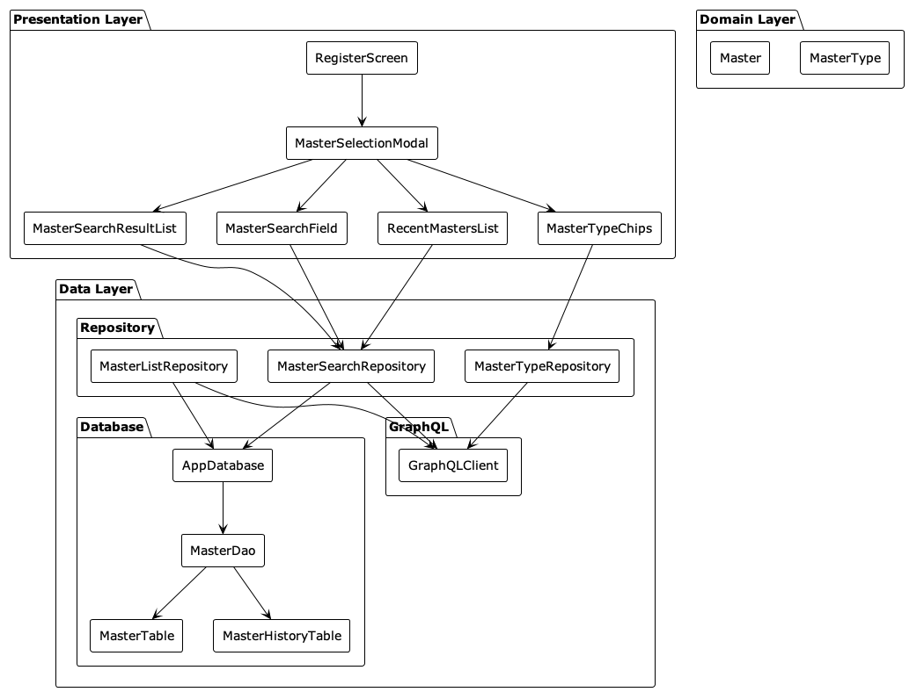

# Flutter sample app

## 📋 プロジェクト概要 / Project Overview

本プロジェクトは、LayerX技術課題への対応を目的としたFlutterアプリケーションです。  
マスタ検索・フィルタリング・複数選択機能を提供し、ローカルDBによる高速な検索と使用履歴の管理を実現しています。

This project is a Flutter application developed for the LayerX technical challenge.  
It features master search, filtering, and multi-selection with local database for fast search and usage history management.

---

## 📱 Demo

<div style="display: flex; gap: 20px;">
  <div>
    <p><strong>Android</strong></p>
    
  </div>
  <div>
    <p><strong>iOS</strong></p>
    
  </div>
</div>

## 🛠️ 使用技術 / Tech Stack

- Flutter SDK: **3.29.2** (or later stable release)
- Dart SDK: **3.7.2** (bundled with Flutter)
- Riverpod (状態管理)
- Flutter Hooks (UIロジック)
- Drift (ローカルDB)
- GraphQL (graphql_flutter)
- Freezed (イミュータブルなデータクラス)

## コンポーネント図


## シーケンス図


---

## 🚀 セットアップ方法 / Getting Started

```bash
git clone <repository URL>
cd <project directory>
flutter pub get
flutter run
```

## 📱 主な機能 / Main Features

- マスタ検索（リアルタイム）
- マスタタイプによるフィルタリング
- 複数マスタの選択
- 使用履歴の管理
- レスポンシブデザイン対応

## 🏗️ プロジェクト構成 / Project Structure

```
lib/
├── common/          # 共通ユーティリティ
├── data/           # データ層
│   ├── database/   # ローカルDB
│   ├── graphql/    # GraphQLクライアント
│   └── repository/ # リポジトリ
├── domain/         # ドメインモデル
└── presentation/   # UI層
    └── pages/      # 画面
```

## 🧪 テスト / Testing

```bash
# ユニットテスト
flutter test

# カバレッジレポート
flutter test --coverage
```

## 📝 Lintの使用方法 / Lint Usage

このプロジェクトでは、コードの品質と一貫性を保つために厳格なLintルールを採用しています。

### Lintルールの確認 / Lint Rules Overview

`analysis_options.yaml`にLintのルールが定義されています。

### Lintの実行方法 / Running Lint

1. **コードの自動フォーマット / Code Formatting**
```bash
dart format lib/ test/
```

2. **Lintチェックの実行 / Lint Check**
```bash
flutter analyze
```

3. **自動修正可能な問題の修正 / Fixing Automatically Fixable Issues**
```bash
dart fix --apply
```

## 🔄 CI/CD / Continuous Integration

このプロジェクトでは、GitHub Actionsを使用して継続的インテグレーション（CI）を実装しています。

### CIの実行内容 / CI Workflow

1. **コードの検証 / Code Validation**
   - Flutter SDKのバージョン確認
   - 依存関係の検証
   - コードフォーマットの確認
   - Lintルールのチェック

2. **テストの実行 / Test Execution**

3. **ビルドの検証 / Build Verification**
   - Androidビルドの検証
   - iOSビルドの検証

### CIの実行タイミング / CI Triggers

- プルリクエスト作成時
- メインブランチへのプッシュ時
- 手動実行（workflow_dispatch）

### CIの設定ファイル / CI Configuration

CIの設定は`.github/workflows/ci.yml`に定義されています。

```yaml
name: CI

on:
  push:
    branches:
      - main
  pull_request:
    branches:
      - main

jobs:
  build-android:
    runs-on: ubuntu-latest
    steps:
      - name: Checkout code
        uses: actions/checkout@v4

      - name: Set up Flutter
        uses: subosito/flutter-action@v2
        with:
          flutter-version: '3.29.2'
          channel: 'stable'

      - name: Install dependencies
        run: flutter pub get

      - name: Analyze code
        run: flutter analyze

      - name: Run tests
        run: flutter test

      - name: Build Android
        run: flutter build apk --release

  build-ios:
    runs-on: macos-latest
    steps:
      - name: Checkout code
        uses: actions/checkout@v4

      - name: Set up Flutter
        uses: subosito/flutter-action@v2
        with:
          flutter-version: '3.29.2'
          channel: 'stable'

      - name: Install dependencies
        run: flutter pub get

      - name: Analyze code
        run: flutter analyze

      - name: Run tests
        run: flutter test

      - name: Build iOS
        run: flutter build ios --no-codesign
```
